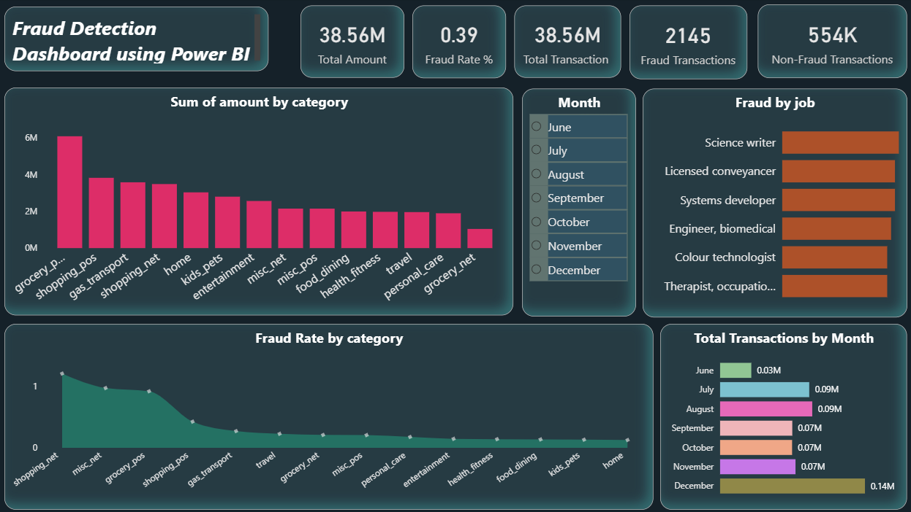

# Fraud Detection Dashboard – Power BI

## Overview
This project presents an interactive **Fraud Detection Dashboard** built with **Power BI**.  
It analyzes transaction data to identify fraudulent activities, providing insights into fraud patterns across categories, jobs, and time.

  
*(Screenshot of the dashboard – replace with actual image if needed)*

---
### Download = https://drive.google.com/file/d/157M40dzqnh7bQQzibjt0bEZiAcjQBAHO/view?usp=drive_link
## Features
- **Key Metrics**  
  - Total Amount (38.56M)  
  - Total Transactions (2145)  
  - Fraud Transactions (554K) – *likely means total fraud amount*  
  - Non‑Fraud Transactions – *count or amount?*  
  - Fraud Rate – *percentage of fraudulent transactions*

- **Category Analysis**  
  - Sum of amount by category (bar chart)  
  - Fraud rate by category (line chart)

- **Job‑based Fraud Patterns**  
  - Top fraudulent jobs (e.g., Science writer, Licensed conveyancer, etc.)

- **Time Trend**  
  - Total transactions by month (June to December)

---

## Data Source
The dashboard is based on a transactional dataset containing:
- Transaction details (amount, category, date)
- Customer job information
- Fraud flag (yes/no)

Data is anonymized and simulated for demonstration purposes.

---

## Key Metrics Explained
| Metric | Value | Description |
|--------|-------|-------------|
| Total Amount | 38.56M | Sum of all transaction amounts |
| Total Transactions | 2145 | Total number of transactions analyzed |
| Fraud Transactions | 554K | Total amount associated with fraudulent transactions |
| Fraud Rate | (calculated) | Percentage of transactions flagged as fraud |

---

## Visuals & Insights

### 1. Sum of Amount by Category
- **grocery.pos**, **gas.transport**, **shopping.net**, **home**, **kids.pets**, **entertainment**, **misc.net**, **misc.pos**, **food.dining**, **health.drives**, **travel**, **personal care**, **groceries**, **net**
- Shows where most money is spent, helping to identify high‑risk categories.

### 2. Fraud Rate by Category
- Compares fraud rate across categories.
- High‑risk categories (e.g., **shopping.net**, **misc.net**) show elevated fraud percentages.

### 3. Frauds by Job
- Lists professions with highest fraud counts.
- Useful for understanding demographic risk profiles.

### 4. Monthly Transaction Trend
- Transactions increase in December (peak: 0.14M), possibly due to holiday spending.

---

## Usage
Open the `.pbix` file in Power BI Desktop.  
Use the slicers (if any) to filter by:
- Date range
- Category
- Job

Hover over visuals for detailed tooltips.

---

## Requirements
- **Power BI Desktop** (latest version)  
- Windows OS (or Power BI service for web viewing)

---

## How to Replicate
1. Load your transaction dataset into Power BI.
2. Build measures:
