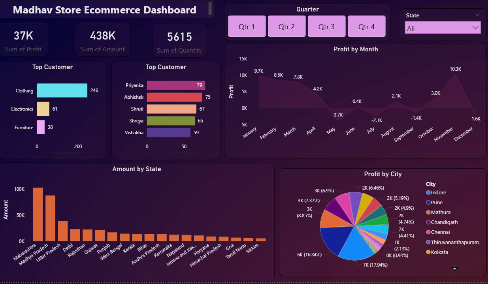

# 🛒 Madhav Store Ecommerce Dashboard (Power BI)

## 🔍 Project Overview
This project showcases an interactive **Ecommerce Sales Dashboard** built using Power BI. It provides a complete overview of sales performance, customer behavior, and business trends across different states and quarters.

The dashboard is designed to convert raw ecommerce data into actionable insights that help in understanding growth patterns and improving decision-making.

---

## 🎯 Objectives
- Track overall sales and order performance  
- Analyze quarterly sales trends  
- Identify high-performing states and regions  
- Understand customer purchase behavior  

---

## 📊 Key Insights
- Sales show clear variation across different quarters  
- Certain states contribute significantly higher revenue  
- Seasonal trends impact overall sales performance  
- Consistent growth observed in selected regions  

---

## 📌 Key Features
- 📈 KPI Cards (Total Sales, Orders, Quantity, Revenue)  
- 📅 Quarter-wise Analysis (Q1, Q2, Q3, Q4)  
- 🌍 State-wise Sales Distribution  
- 📊 Interactive Filters for deep insights  
- 📉 Trend Analysis for better forecasting  

---

## 🛠 Tools & Technologies
- **Power BI** – Data Visualization  
- **DAX** – Calculations & Measures  
- **Excel / CSV** – Data Source  

---

## 📷 Dashboard Preview

### 🔹 Main Dashboard

---

## 📁 Files Included
- `MadhavDashboard.pbix` – Power BI Dashboard  
- `dataset.xlsx` – Dataset used  
- `dashboard.png` – Dashboard preview  

---

## 🚀 How to Use
1. Download the `.pbix` file  
2. Open in Power BI Desktop  
3. Use filters (Quarter, State) to explore insights  

---

## 💡 Future Improvements
- Add customer segmentation analysis  
- Integrate real-time ecommerce data  
- Enhance forecasting with advanced models  

---

## 📬 Contact
Open to feedback and collaboration.

---

⭐ If you found this project useful, don’t forget to star the repository!
