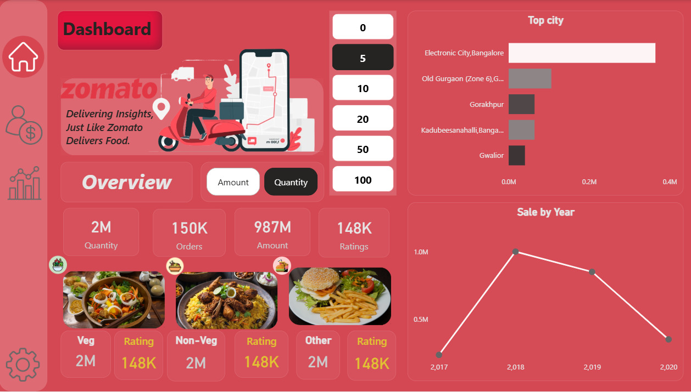
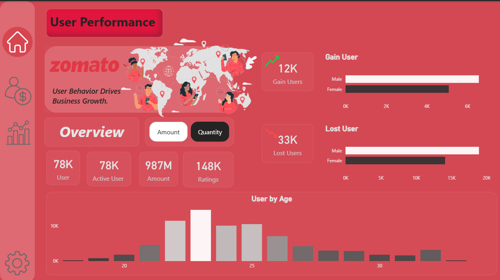
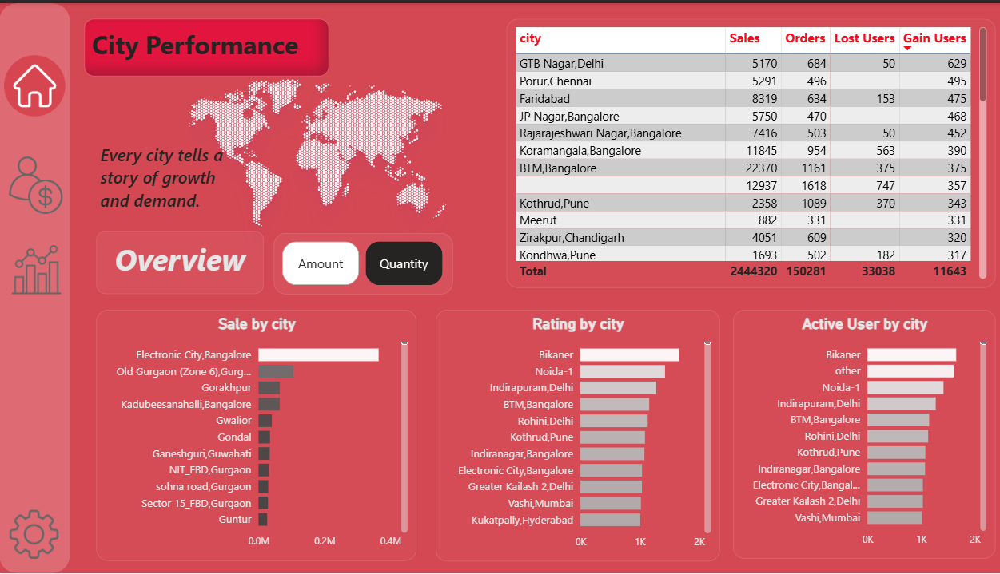

# 🍽️ Zomato Analytics Dashboard – Power BI

## 📋 Overview  
This **interactive dashboard** provides a comprehensive view of Zomato’s city‑wise performance, user behavior, and sales trends. Built with **Power BI**, it helps business stakeholders monitor growth, identify top cities, analyze menu preferences, and track user acquisition.

  
 
 
*(Replace with actual screenshot)*

---

## 🧩 Dashboard Components  

### 1️⃣ City Performance  
- **Sale by City** – bar chart showing total amount and quantity sold per city.  
- **Rating by City** – list of cities ranked by average rating.  
- **Active User by City** – list of cities with the highest active user counts.  

### 2️⃣ Zomato Dashboard  
- **Top Cities** – cities contributing the most to sales (e.g., Electronic City, Old Gurgaon, Gorakhpur).  
- **Sale by Year** – line chart showing sales trend from 2017 to 2020.  
- **Menu Items Breakdown** – key metrics segmented by food type:  
  - Veg: 2M Quantity, 2M Rating  
  - Non‑Veg: 150K Orders, 2M Amount  
  - Other: 987M Amount, 148K Quantity  
- **Key KPIs** – Amount, Quantity, Orders, Rating (displayed in cards).  

### 3️⃣ User Performance  
- **Active Users** – 78K active users.  
- **Amount & Ratings** – 987M amount, 148K ratings.  
- **Gain / Lost Users** – split by gender:  
  - Male: 12K gained, 33K lost  
  - Female: 0K gained, 0K lost *(data suggests low female activity)*  
- **User by Age** – distribution of users across age groups (20‑30 years dominant).  

---

## 📊 Key Metrics at a Glance  

| Metric | Value | Description |
|--------|-------|-------------|
| 🧑‍🤝‍🧑 Active Users | 78K | Total number of active users |
| 💰 Total Amount | 987M | Sum of order amounts |
| ⭐ Total Ratings | 148K | Number of ratings submitted |
| 🍽️ Veg Quantity | 2M | Quantity of vegetarian items sold |
| 🍗 Non‑Veg Orders | 150K | Orders of non‑vegetarian items |
| 📈 Sales Peak Year | 2020 | Highest sales recorded |

---

## 🔍 Key Insights  

- **Top Cities** – Electronic City (Bangalore), Old Gurgaon, and Gorakhpur lead in sales.  
- **Sales Trend** – steady growth from 2017, with a sharp rise in 2020 (possibly due to increased online food ordering).  
- **User Demographics** –  
  - Male users dominate, with a net loss of 21K (33K lost vs. 12K gained).  
  - Female user engagement appears negligible in this dataset.  
  - Age group 20‑30 forms the core user base.  
- **Menu Preferences** – Vegetarian items account for 2M in quantity, while non‑veg orders are relatively lower in quantity but still significant. “Other” category (likely beverages, desserts) contributes the largest monetary value (987M).  

---

## 🧰 Data Model (Assumed)  

The dashboards are built on three main tables:

- **Orders** – order_id, date, city, amount, quantity, user_id, food_type (veg/non‑veg/other)  
- **Users** – user_id, age, gender, status (active/lost)  
- **Ratings** – rating_id, user_id, city, rating_value  

Relationships:  
- Orders[user_id] → Users[user_id]  
- Orders[city] & Ratings[city] → City dimension (implied)  

---

## 📥 Requirements  
- **Power BI Desktop** (latest version)  
- Windows OS or Power BI service for web viewing  

---

## 🛠️ How to Replicate  

1. Load your Zomato transaction and user data into Power BI.  
2. Create measures like:  
