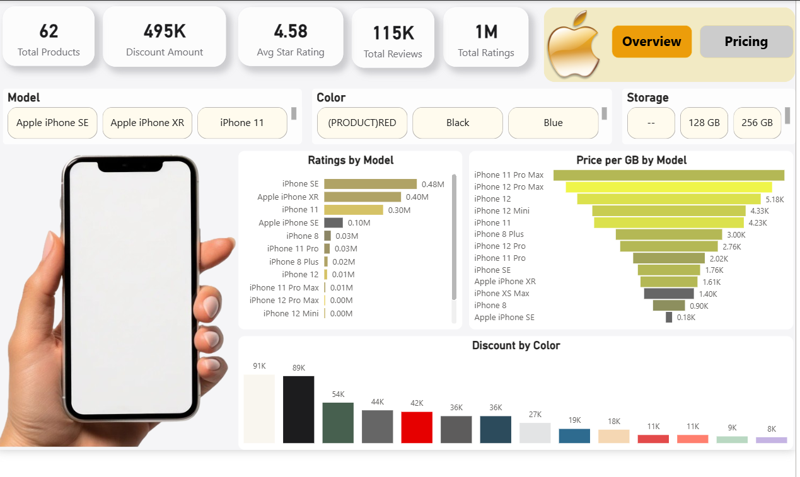
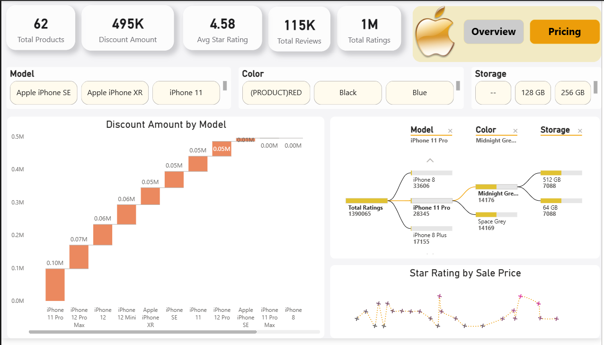

# 🍎 iPhone Sales Analysis Dashboard (Power BI)

## 🔍 Project Overview
This project presents an interactive **iPhone Sales Analysis Dashboard** built using Power BI. It focuses on analyzing product performance, discounts, ratings, and customer preferences across different iPhone models, colors, and storage variants.

The goal is to convert raw product data into actionable insights for better business understanding and decision-making.

---

## 🎯 Objectives
- Analyze sales performance of different iPhone models  
- Understand the impact of discounts on sales  
- Evaluate customer ratings and reviews  
- Identify popular product configurations (Color & Storage)  

---

## 📊 Key Insights
- High-rated products tend to maintain stable pricing  
- Discount strategies vary significantly across models  
- Certain storage variants (like 128GB/256GB) dominate sales  
- Premium models receive higher engagement in reviews  

---

## 📌 Key Features
- 📦 Total Products, Ratings, Reviews & Discounts KPIs  
- 📉 Discount Analysis by Model (Waterfall Chart)  
- ⭐ Star Rating Trends by Sale Price  
- 🎨 Product segmentation by Color and Storage  
- 📊 Model-wise performance breakdown  
- 🔍 Interactive filters for deep analysis  

---

## 🛠 Tools & Technologies
- **Power BI** – Dashboard & Visualization  
- **DAX** – Calculated measures  
- **Excel / CSV** – Dataset  

---

## 📷 Dashboard Preview

### 🔹 Overview Page

### 🔹 Detailed Analysis

---

## 📁 Files Included
- `iPhoneDashboard.pbix` – Power BI Dashboard  
- `dataset.xlsx` – Source data  
- `overview.png` – Dashboard screenshot  
- `analysis.png` – Dashboard screenshot  

---

## 🚀 How to Use
1. Download the `.pbix` file  
2. Open in Power BI Desktop  
3. Use filters (Model, Color, Storage) to explore insights  

---

## 📬 Contact
Feel free to connect for feedback or collaboration.

---

⭐ If you found this project useful, consider giving it a star!
